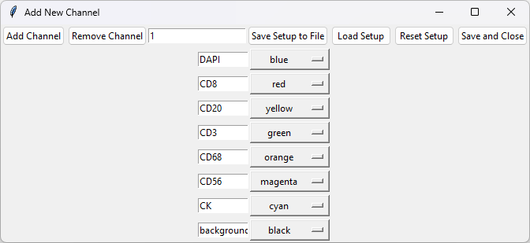

# TME_Analyzer
## Getting started

### Venv

Get python version 3.8.10
- Create a venv: `python.exe -m venv .venv`
- Activate the environment `./.venv/Scripts/Activate.ps1`; 
  - Maybe with an execution policy:  `powershell -ExecutionPolicy Bypass -File "./.venv/Scripts/Activate.ps1"`
- install dependencies: `python.exe -m pip install -r requirements.txt`
  - note that requirements.txt give the minimal packages, and this should get all the packages in the requirements_extended.txt file
  
And run: `python.exe TME_analyzer.py`

### Conda

Run: `mamba env create -f environment.yml`

And run: `python.exe TME_analyzer.py`

## Cx-Freeze

Pack the project into a single binary with: 
```python setup.py build```

## Analysis tutorial

### Channel setup

By default, TME-A names image channels as C1, C2, etc. when you open an image with it.
The channel setup should be input to the software before loading of images in order to have the proper naming of the channels, together with the display colors.
This is achieved by going to Loading->Change Channel Setup, which opens a new window.
Here you should see a dropdown that is set to Default, with no other options present. 
By pressing "Add Channels Setup", you can setup your own channel names, which will appear in this dropdown.
For the sample analysis, press "Add Channel" 7 times (so the total number of channels are 8).
And name them in the order of "DAPI", "CD8", "CD20", "CD3", "CD68", "CD56", "CK" and "background".
The corresponding colors used in the manuscript, which can be selected from the dropdown, are blue, red, yellow, green, orange, magenta, cyan and black.

You can save this channel setup by clicking "Save Setup to File", or load saved setup by clicking "Load Setup".
Once done, press "Save and Close".

Now this setup should appear in the dropdown as:
"DAPI:blue, CD8:red, CD20:yellow, CD3:green, CD68:orange, CD56:magenta, CK:cyan, background black"

Alternatively, if you press "Load default channels", again a new dropdown option will appear: 
"TNBC: DAPI:blue, CD8:red, CD20:yellow, CD3:green, CD68:orange, CD56:magenta, CK:cyan"

Select the channel setup of preference, and press confirm.

### Image loading
You can open image loading window by going through Loading->Load Image or directly pressing the "Load Image" in the toolbar. This allows you to load multiple tiff images. "Load Folder" is specifically designed for loading outputs of Vectra imaging, where images with "_component_data.tif" ending are loaded, with the options of combining images, stitching them (based on their coordinates outputted from Vectra) and downscaling.
Go ahead and load the provided image, "sample image (1).tif". This should now provide you with a list of channels and colors at the right, with "Display" button at the bottom, and a dropdown menu under it, where currently the option is "sample image (1).tif". As you load more images they are appended to this dropdown menu, and here you can change the image you are currently working on.

### Threshold Foreground
The first step of image analysis is to discriminate the tissue from non tissue.